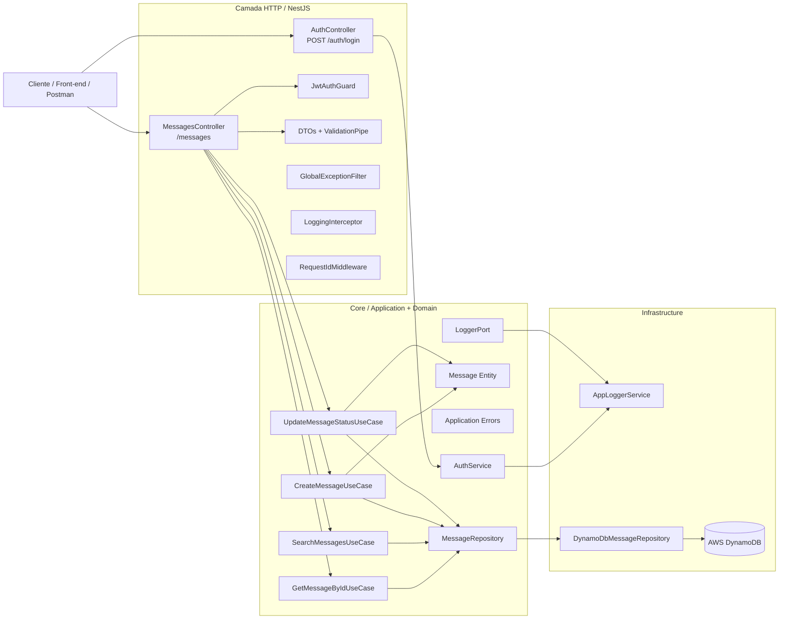

# Messages API

API RESTful para gerenciamento de mensagens com NestJS, organizada com Clean Architecture e preparada para integracao com um front-end futuramente.

O projeto agora segue um fluxo simples:

- a API roda localmente com Node.js
- a persistencia usa DynamoDB na AWS
- nao ha mais dependencia de Docker ou DynamoDB local

## Stack

- Node.js
- NestJS
- TypeScript
- AWS DynamoDB
- JWT
- Swagger
- Jest
- Winston

## Funcionalidades

- `POST /messages`: cria uma mensagem
- `GET /messages/:id`: busca uma mensagem por ID
- `GET /messages?sender=...`: busca mensagens por remetente
- `GET /messages?startDate=...&endDate=...`: busca mensagens por periodo
- `GET /messages?sender=...&startDate=...&endDate=...`: combina remetente e periodo
- `PATCH /messages/:id/status`: atualiza o status da mensagem
- `POST /auth/login`: gera um JWT para acesso aos endpoints protegidos

## Arquitetura

O projeto foi estruturado com:

- Clean Architecture
- Ports and Adapters
- DTOs com validacao
- Casos de uso isolando a regra de negocio
- Repositorio DynamoDB como adaptador de persistencia
- Logging estruturado, request id e exception filter global

Estrutura principal:

```text
src/
├── core/                # dominio e aplicacao
├── infrastructure/      # HTTP, persistencia e logging
└── common/              # filtros, interceptors e middlewares
```

## Requisitos

- Node.js 20 ou superior
- Yarn 1.x
- AWS CLI configurado ou credenciais AWS disponiveis no ambiente
- Permissao para criar/consultar tabelas no DynamoDB

## Configuracao

Crie o arquivo de ambiente:

```bash
cp .env.example .env
```

Variaveis esperadas:

```env
PORT=3000
AUTH_USERNAME=your-username
AUTH_PASSWORD=your-password
JWT_SECRET=change-me
AWS_REGION=us-east-1
DYNAMODB_TABLE_NAME=messages
```

Credenciais AWS podem ser fornecidas de uma destas formas:

- via `aws configure`
- via variaveis `AWS_ACCESS_KEY_ID`, `AWS_SECRET_ACCESS_KEY` e `AWS_SESSION_TOKEN`
- via role, profile ou credenciais do ambiente de deploy

## DynamoDB na AWS

O projeto espera uma tabela com este schema:

- chave primaria: `pk` (HASH) + `sk` (RANGE)
- GSI `gsi1`: `gsi1pk` (HASH) + `gsi1sk` (RANGE)
- GSI `gsi2`: `gsi2pk` (HASH) + `gsi2sk` (RANGE)

Para criar a tabela na AWS com o schema correto:

```bash
yarn dynamo:create
```

O script usa `AWS_REGION` e `DYNAMODB_TABLE_NAME` do ambiente atual.

## Executando a API

Instale as dependencias:

```bash
yarn install
```

Suba a aplicacao:

```bash
yarn start:dev
```

Swagger:

```text
http://localhost:3000/docs
```

## Autenticacao

O login usa os valores configurados em `AUTH_USERNAME` e `AUTH_PASSWORD`.

Endpoint:

```http
POST /auth/login
```

Exemplo de payload:

```json
{
  "username": "your-username",
  "password": "your-password"
}
```

Use o token retornado como `Bearer Token` nos endpoints de mensagens.

## Exemplos de uso

Criar mensagem:

```http
POST /messages
Authorization: Bearer <token>
Content-Type: application/json
```

```json
{
  "content": "Hello world",
  "sender": "rafael"
}
```

Atualizar status:

```http
PATCH /messages/:id/status
Authorization: Bearer <token>
Content-Type: application/json
```

```json
{
  "status": "READ"
}
```

Buscar mensagens:

```text
GET /messages?sender=rafael
GET /messages?startDate=2026-03-01T00:00:00.000Z&endDate=2026-03-21T23:59:59.999Z
GET /messages?sender=rafael&startDate=2026-03-01T00:00:00.000Z&endDate=2026-03-21T23:59:59.999Z
```

## Modelagem DynamoDB

Cada item de mensagem e salvo com os atributos:

- `pk = MESSAGE#<id>`
- `sk = METADATA`
- `gsi1pk = SENDER#<sender>`
- `gsi1sk = sentAt`
- `gsi2pk = MESSAGE`
- `gsi2sk = sentAt`

Essa modelagem cobre os acessos exigidos pelo desafio:

- busca por ID
- busca por remetente
- busca por periodo
- busca por remetente + periodo

## Observabilidade

A aplicacao possui:

- logging estruturado com Winston
- request id por requisicao
- interceptor de tempo de resposta
- global exception filter

## Testes

Testes unitarios cobrem:

- entidade `Message`
- `CreateMessageUseCase`
- `GetMessageByIdUseCase`
- `SearchMessagesUseCase`
- `UpdateMessageStatusUseCase`

Testes e2e cobrem:

- autenticacao com JWT
- criacao e consulta de mensagem por ID
- atualizacao de status
- buscas por remetente e por periodo

Executar testes:

```bash
yarn test
```

Executar testes e2e:

```bash
yarn test:e2e
```

Gerar build:

```bash
yarn build
```

## Decisoes tecnicas

### DynamoDB

Foi escolhido por combinar bem com o desafio:

- baixa latencia
- escalabilidade horizontal
- modelagem orientada aos padroes de acesso

### Clean Architecture

Ajuda a manter:

- baixo acoplamento
- facilidade de testes
- independencia do framework HTTP e da persistencia

### Autenticacao e observabilidade

Os diferenciais adicionados foram:

- autenticacao via JWT
- logs estruturados
- rastreabilidade por request id

## Fluxo da API


