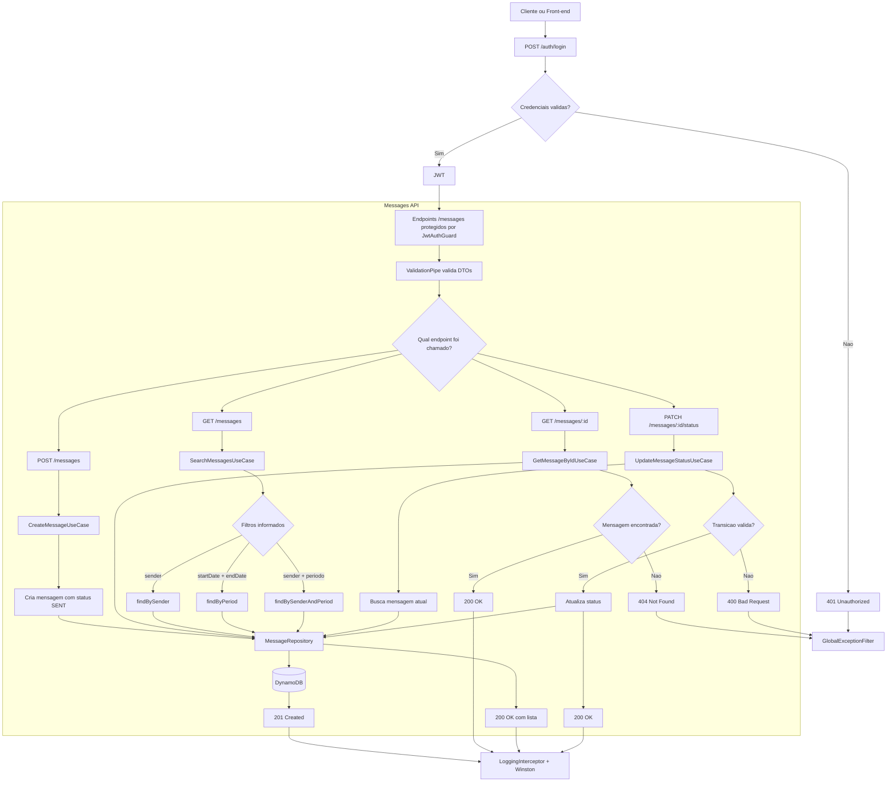
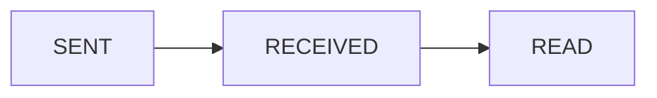

# API Flowchart

Este fluxograma resume o fluxo principal da aplicacao e os caminhos exigidos no desafio.

## Regra de status

## Leitura rapida para avaliacao

- `POST /messages` sempre cria a mensagem com status inicial `SENT`.
- `PATCH /messages/:id/status` respeita a regra `SENT -> RECEIVED -> READ`.
- `GET /messages` aceita busca por remetente, por periodo, ou a combinacao dos dois filtros.
- Persistencia e consultas sao resolvidas via `MessageRepository`, mantendo a aplicacao desacoplada do banco.
